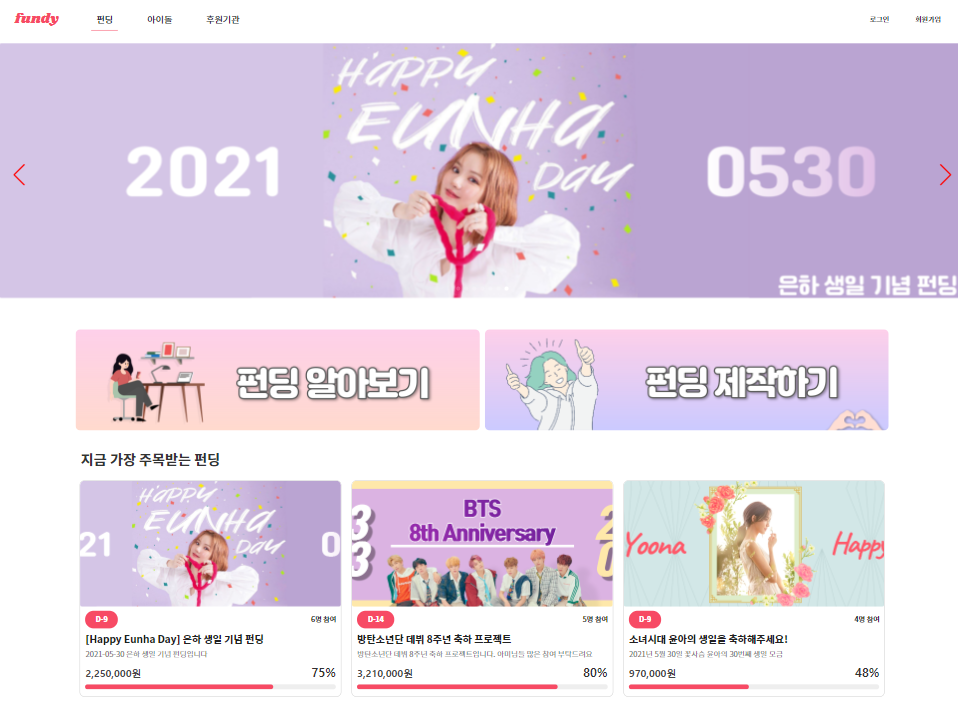

<div align="center" style="margin-top: 30px">
	<h1>
    	펀디
	</h1>
</div>
<div align="center">아이돌과 팬을 연결해주는 크라우드 펀딩 플랫폼</center></div>

<br/>

<div align="center" style="font-weight: bold;">
    <a href="https://framer.com/projects/nq3RKAROYiLd77SMeajY-gRgqD?node=fnXmMIrcT-page">UI/UX기획안</a> · <a href="https://drive.google.com/file/d/1Md6e8NxUM11q6FLsfwttKSz59WVhBOXa/view?usp=sharing">프로젝트 계획서</a></div>

<br/>


##  📎 프로젝트 소개

> 아이돌 후원도 하고 기부도 하자, 덕질로 기부천사!



<br/>

**펀디는 기존 크라우드 펀딩 서비스와는 다른 ‘기부'라는 차별화를 가진 서비스입니다.**

소극적인 추종자나 소비자에 불과했던 팬이 지금은 전문가 수준으로 파고드는 ‘덕후’로 영향력을 행사하며 새로운 문화를 만들어내고 있습니다. 물건으로 아이돌을 서포트하던 예전 문화와 달리 최근엔 아이돌 이름으로 기부하는 문화로 바뀌고 있습니다. 일부 아이돌이 서포트를 받지 않는다고 밝히니 팬들의 조공 형태도 바뀐것입니다. 아이돌의 생일, 데뷔, 졸업마다 팬들은 돈을 모아 기부를 합니다. 


**팬들은 안심하고 아이돌 후원 펀딩을 할 수 있습니다.**

기존의 펀딩 서비스에서 항상 언급되는 문제는 펀딩 주최자에 대한 신뢰를 가늠할 수 없다는 것이었습니다. 이에 따라, 저희는 팬들이 믿고 후원할 수 있는 가장 좋은 방법은 펀딩의 주최자에 대한 신뢰를 높이는 것이라 생각했고, 이에 펀딩 주최자를 검증하는 단계별 인증 시스템을 도입했습니다.또한, 기존 아이돌 펀딩 서비스에 더하여 기부 전용 펀딩을 만들어 아이돌의 이름으로 사회에 선한 영향력을 끼칠 수 있도록 서비스를 기획했습니다.
기존 아이돌 크라우드 펀딩 서비스와 차별점으로 팬들이 아이돌 활동을 지원하기 위해 믿고 펀딩할 수 있는 ‘인증절차'를 도입하고 ‘기부’를 강조해 사회에 도움이 되는 서비스를 만드는 것이 저희의 목표입니다.

<br/>

### 📋 프로젝트 산출물

- [프로젝트 계획서](https://drive.google.com/file/d/1Md6e8NxUM11q6FLsfwttKSz59WVhBOXa/view?usp=sharing)
- [기능 명세서](https://docs.google.com/spreadsheets/d/14dcq-uyzevq-k0-2NE4M6FZEaasjqon-pJ8xwLy-NWM/edit#gid=0)
- [플로우 차트](https://app.diagrams.net/#G1o_Rt7eHdJsrH3c5dRuHwS_2vpibGvGel)
- [와이어프레임 및 기획안](https://framer.com/projects/nq3RKAROYiLd77SMeajY-gRgqD?node=fnXmMIrcT-page)


### 🏗️ Built With

##### 사용한 프레임워크

- [React](https://reactjs.org/)
- [Spring](https://spring.io/)

<br/>

## ⚙️ Getting Started

펀디 시작 방법입니다. 클라이언트 실행방법을 설명해드립니다.


### Installation


##### Clone the repo
   ```
   git clone https://lab.ssafy.com/s04-final/s04p31a303.git
   ```


##### Front-end

1. Change directory

```
cd frontend
```


2. Install npm packages

```
yarn -i
```

3. Run
```
yarn start
```


##### Back-end

1.  Change directory

```
cd backend
```

2. Run

```
.\gradlew bootRun
```

<br/>


## ⚒️ 개발스택

협업 Tool

- Notion
- Framer
- ERDCloud

Language

- Typescript
- Java

DBMS

- MySQL

Library

- React
- Redux
- JWT

<br/>

## 👥 Contact

### [Samsung Software Academy for Youth](https://www.ssafy.com/) 4th Seoul, 자율프로젝트 A303

- Frontend Developer (github and email)
  - `김재성` - [@JS-2](https://github.com/JS-2) - [kimjea23@naver.com](mailto:kimjea23@naver.com)
  - `이원찬` - [@chany219](https://github.com/chany219) - [chany219@naver.com](mailto:chany219@naver.com)
- Backend Developer (github and email)
  - `김윤성` - [@example](https://github.com/example) - [example@naver.com](example@naver.com)
  - `이나영` - [@bokiri409](https://github.com/bokiri409) - [bokiri16@gmail.com](mailto:bokiri16@gmail.com)

Project Link: https://www.ilovefundy.com/


