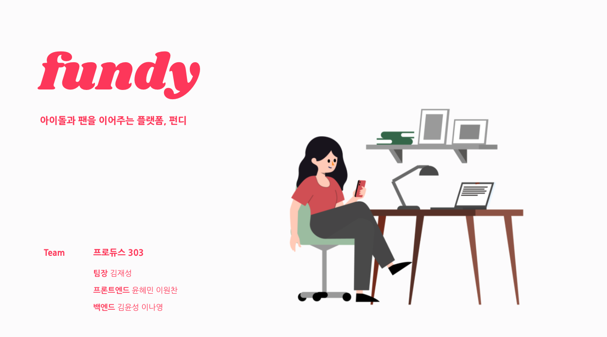

<center>
<h1>
    펀디
    </h1>
</center>
<center>아이돌과 팬을 연결해주는 크라우드 펀딩 플랫폼</center>
<center><a href="https://framer.com/projects/nq3RKAROYiLd77SMeajY-gRgqD?node=fnXmMIrcT-page">UI/UX기획안</a> · <a href="https://drive.google.com/file/d/1Md6e8NxUM11q6FLsfwttKSz59WVhBOXa/view?usp=sharing">프로젝트 계획서</a></center>


##  📎 프로젝트 소개

> 덕질로 기부천사, 함께하는 기부처


펀디는 기존 크라우드 펀딩 서비스와는 다른 ‘기부'라는 차별화를 강조해 사회에 도움이 되는 서비스입니다.

디지털 플랫폼 발달로 국내 영상, 음악 등 콘텐츠에 대한 글로벌 접근성이 높아지고 수요가 확대되며 다양한 지역에서 한류 팬덤이 형성됐다.전 세계 한류 커뮤니티(팬클럽 등) 회원 수가 매년 증가하는 가운데, 최근 아시아 지역(2014~2019년 연평균 성장률 32.3%)뿐만 아니라 아메리카(35%), 유럽(60.7%) 등에서도 크게 증가했다.음악 산업에서는 전 세계 실물음반 시장 축소 추세에도 불구하고 K-pop 음반 판매량은 크게 증가해 전 세계적인 한류 팬덤의 위력을 입증하고 있다.


뭐라쓸까...


### 📋 프로젝트 산출물

- [프로젝트 계획서](https://drive.google.com/file/d/1Md6e8NxUM11q6FLsfwttKSz59WVhBOXa/view?usp=sharing)
- [기능 명세서](https://docs.google.com/spreadsheets/d/14dcq-uyzevq-k0-2NE4M6FZEaasjqon-pJ8xwLy-NWM/edit#gid=0)
- [플로우 차트](https://app.diagrams.net/#G1o_Rt7eHdJsrH3c5dRuHwS_2vpibGvGel)
- [와이어프레임 및 기획안](https://framer.com/projects/nq3RKAROYiLd77SMeajY-gRgqD?node=fnXmMIrcT-page)


### 🏗️ Built With

##### 사용한 프레임워크

- React
- Spring Boot


## ⚙️ Getting Started

펀디 시작 방법입니다. 클라이언트 실행방법을 설명해드립니다.


### Installation


##### Clone the repo
   ```
   git clone https://lab.ssafy.com/s04-final/s04p31a303.git
   ```


##### Front-end

1. Change directory

    ```
    cd frontend
    ```


2. Install npm packages

    ```
    yarn -i
    ```

3. Run
   ```
   yarn start
   ```


##### Back-end

1.  Change directory

   ```
   cd backend
   ```

2. Run

   ```
   .\gradlew bootRun
   ```


## ⚒️ 개발스택

협업 Tool

- Notion
- Framer
- ERDCloud

Language

- Typescript
- Java

DBMS

- MySQL

Library

- React
- Redux
- JWT


## 👥 Contact

### [Samsung Software Academy for Youth](https://www.ssafy.com/) 4th Seoul, 자율프로젝트 A303

- Frontend Developer (github and email)
  - `김재성` - [@JS-2](https://github.com/JS-2) - [kimjea23@naver.com](mailto:kimjea23@naver.com)
  - `이원찬` - [@chany219](https://github.com/chany219) - [chany219@naver.com](mailto:chany219@naver.com)
- Backend Developer (github and email)
  - `김윤성` - [@example](https://github.com/example) - [example@naver.com](example@naver.com)
  - `이나영` - [@bokiri409](https://github.com/bokiri409) - [bokiri16@gmail.com](mailto:bokiri16@gmail.com)

Project Link: https://www.ilovefundy.com/


